# Favornoms — Mermaid Diagrams

> Visual companion to `docs/USER-FLOWS.md`. Renders on GitHub, VS Code (with Mermaid extension), Notion, Obsidian, etc.

## Table of contents

1. [System architecture](#1-system-architecture)
2. [Cross-role data flow](#2-cross-role-data-flow)
3. [Role permissions matrix](#3-role-permissions-matrix)
4. [State machines](#4-state-machines)
5. [Sequence diagrams](#5-sequence-diagrams)
6. [ER diagram (core tables)](#6-er-diagram-core-tables)

---

## 1. System architecture

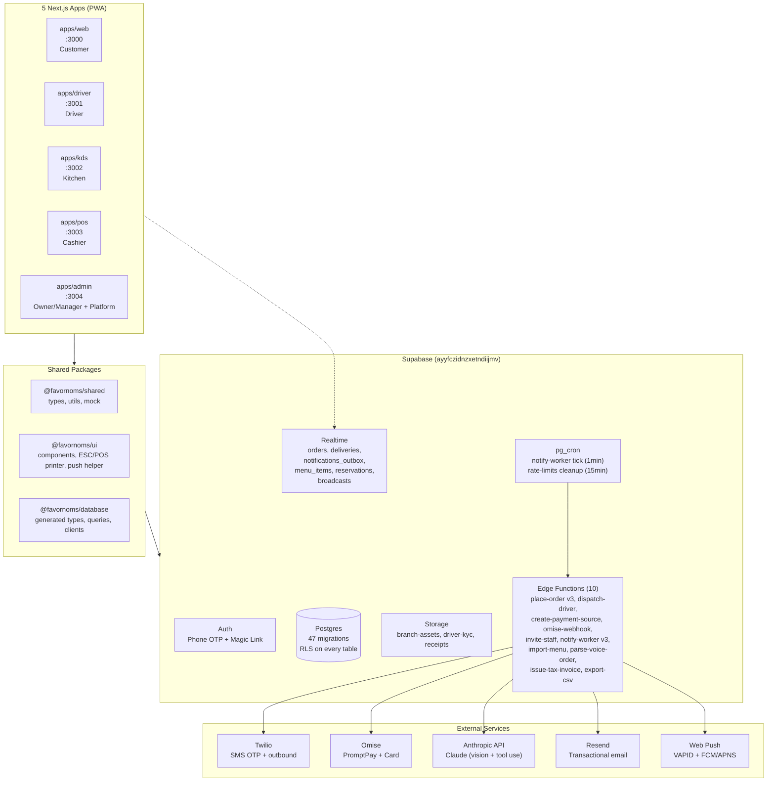
```mermaid
flowchart TB
    subgraph Apps["5 Next.js Apps (PWA)"]
        Web["apps/web<br/>:3000<br/>Customer"]
        Driver["apps/driver<br/>:3001<br/>Driver"]
        KDS["apps/kds<br/>:3002<br/>Kitchen"]
        POS["apps/pos<br/>:3003<br/>Cashier"]
        Admin["apps/admin<br/>:3004<br/>Owner/Manager + Platform"]
    end

    subgraph Packages["Shared Packages"]
        Shared["@favornoms/shared<br/>types, utils, mock"]
        UI["@favornoms/ui<br/>components, ESC/POS printer, push helper"]
        DB["@favornoms/database<br/>generated types, queries, clients"]
    end

    subgraph Supabase["Supabase (ayyfczidnzxetndiijmv)"]
        Auth["Auth<br/>Phone OTP + Magic Link"]
        Postgres[("Postgres<br/>47 migrations<br/>RLS on every table")]
        Storage["Storage<br/>branch-assets, driver-kyc, receipts"]
        Realtime["Realtime<br/>orders, deliveries,<br/>notifications_outbox,<br/>menu_items, reservations,<br/>broadcasts"]
        EdgeFns["Edge Functions (10)<br/>place-order v3, dispatch-driver,<br/>create-payment-source, omise-webhook,<br/>invite-staff, notify-worker v3,<br/>import-menu, parse-voice-order,<br/>issue-tax-invoice, export-csv"]
        Cron["pg_cron<br/>notify-worker tick (1min)<br/>rate-limits cleanup (15min)"]
    end

    subgraph External["External Services"]
        Twilio["Twilio<br/>SMS OTP + outbound"]
        Omise["Omise<br/>PromptPay + Card"]
        Anthropic["Anthropic API<br/>Claude (vision + tool use)"]
        Resend["Resend<br/>Transactional email"]
        WebPush["Web Push<br/>VAPID + FCM/APNS"]
    end

    Apps --> Packages
    Packages --> Supabase
    Apps -.-> Realtime
    EdgeFns --> Twilio
    EdgeFns --> Omise
    EdgeFns --> Anthropic
    EdgeFns --> Resend
    EdgeFns --> WebPush
    Cron --> EdgeFns
```

---

## 2. Cross-role data flow

The end-to-end happy path from customer order to delivery + rating.

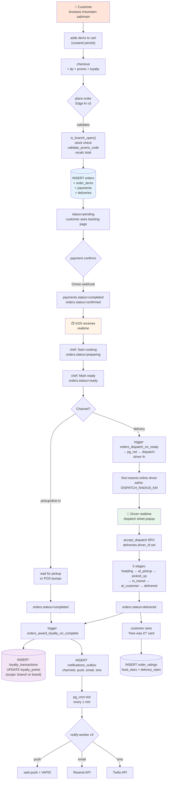
```mermaid
flowchart TD
    A["👤 Customer<br/>browses /r/somtam-zab/main"] --> B["adds items to cart<br/>(zustand persist)"]
    B --> C["checkout<br/>+ tip + promo + loyalty"]
    C --> D{"place-order<br/>Edge fn v3"}
    D -->|validates| D1["is_branch_open()<br/>stock check<br/>validate_promo_code<br/>recalc total"]
    D1 --> E[("INSERT orders<br/>+ order_items<br/>+ payments<br/>+ deliveries")]
    E --> F["status=pending<br/>customer sees tracking page"]

    F --> G{"payment confirms"}
    G -->|Omise webhook| H["payments.status=completed<br/>orders.status=confirmed"]

    H --> I["📺 KDS receives<br/>realtime"]
    I --> J["chef: Start cooking<br/>orders.status=preparing"]
    J --> K["chef: Mark ready<br/>orders.status=ready"]

    K --> L{Channel?}
    L -->|delivery| M["trigger orders_dispatch_on_ready<br/>→ pg_net → dispatch-driver fn"]
    L -->|pickup/dine-in| N["wait for pickup<br/>or POS bumps"]

    M --> O["find nearest online driver<br/>within DISPATCH_RADIUS_KM"]
    O --> P["🛵 Driver realtime<br/>dispatch sheet popup"]
    P --> Q["accept_dispatch RPC<br/>deliveries.driver_id set"]
    Q --> R["5 stages:<br/>heading → at_pickup → picked_up<br/>→ in_transit → at_customer → delivered"]

    R --> S["orders.status=delivered"]
    N --> S2["orders.status=completed"]

    S --> T["trigger orders_award_loyalty_on_complete"]
    S2 --> T
    T --> U[("INSERT loyalty_transactions<br/>UPDATE loyalty_points<br/>(scope: branch or brand)")]

    T --> V["INSERT notifications_outbox<br/>channels: push, email, sms"]
    V --> W["pg_cron tick<br/>every 1 min"]
    W --> X{notify-worker v3}
    X -->|push| X1["web-push + VAPID"]
    X -->|email| X2["Resend API"]
    X -->|sms| X3["Twilio API"]

    S --> Y["customer sees<br/>'How was it?' card"]
    Y --> Z[("INSERT order_ratings<br/>food_stars + delivery_stars")]

    style A fill:#FFE5D9
    style I fill:#FFF4E5
    style P fill:#E8F5E9
    style E fill:#E3F2FD
    style U fill:#F3E5F5
```

---

## 3. Role permissions matrix

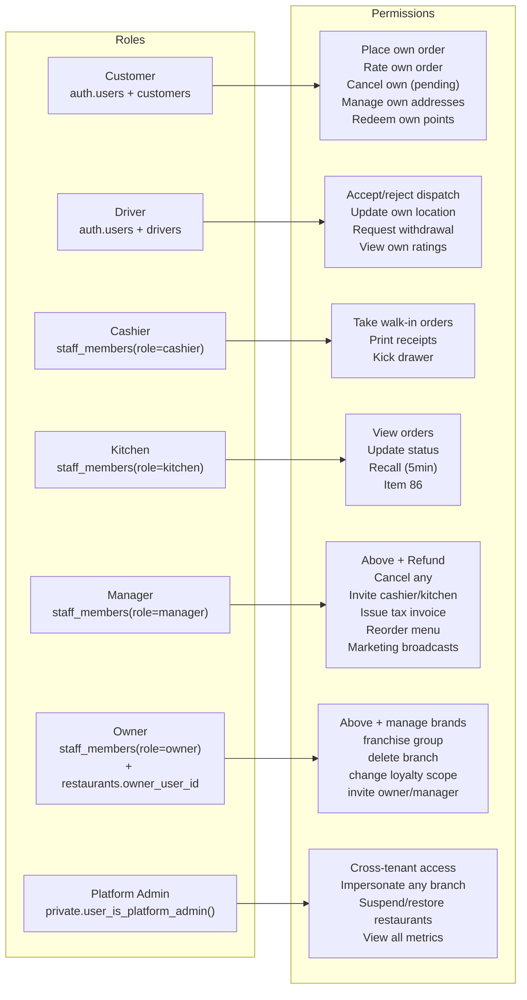
```mermaid
flowchart LR
    subgraph Roles["Roles"]
        C["Customer<br/>auth.users + customers"]
        D["Driver<br/>auth.users + drivers"]
        Csh["Cashier<br/>staff_members(role=cashier)"]
        K["Kitchen<br/>staff_members(role=kitchen)"]
        M["Manager<br/>staff_members(role=manager)"]
        O["Owner<br/>staff_members(role=owner)<br/>+ restaurants.owner_user_id"]
        P["Platform Admin<br/>private.user_is_platform_admin()"]
    end

    subgraph Permissions["Permissions"]
        PL["Place own order<br/>Rate own order<br/>Cancel own (pending)<br/>Manage own addresses<br/>Redeem own points"]
        DR["Accept/reject dispatch<br/>Update own location<br/>Request withdrawal<br/>View own ratings"]
        PR["Take walk-in orders<br/>Print receipts<br/>Kick drawer"]
        KR["View orders<br/>Update status<br/>Recall (5min)<br/>Item 86"]
        MR["Above + Refund<br/>Cancel any<br/>Invite cashier/kitchen<br/>Issue tax invoice<br/>Reorder menu<br/>Marketing broadcasts"]
        OR["Above + manage brands<br/>franchise group<br/>delete branch<br/>change loyalty scope<br/>invite owner/manager"]
        PR2["Cross-tenant access<br/>Impersonate any branch<br/>Suspend/restore restaurants<br/>View all metrics"]
    end

    C --> PL
    D --> DR
    Csh --> PR
    K --> KR
    M --> MR
    O --> OR
    P --> PR2
```

---

## 4. State machines

### 4.1 Order status

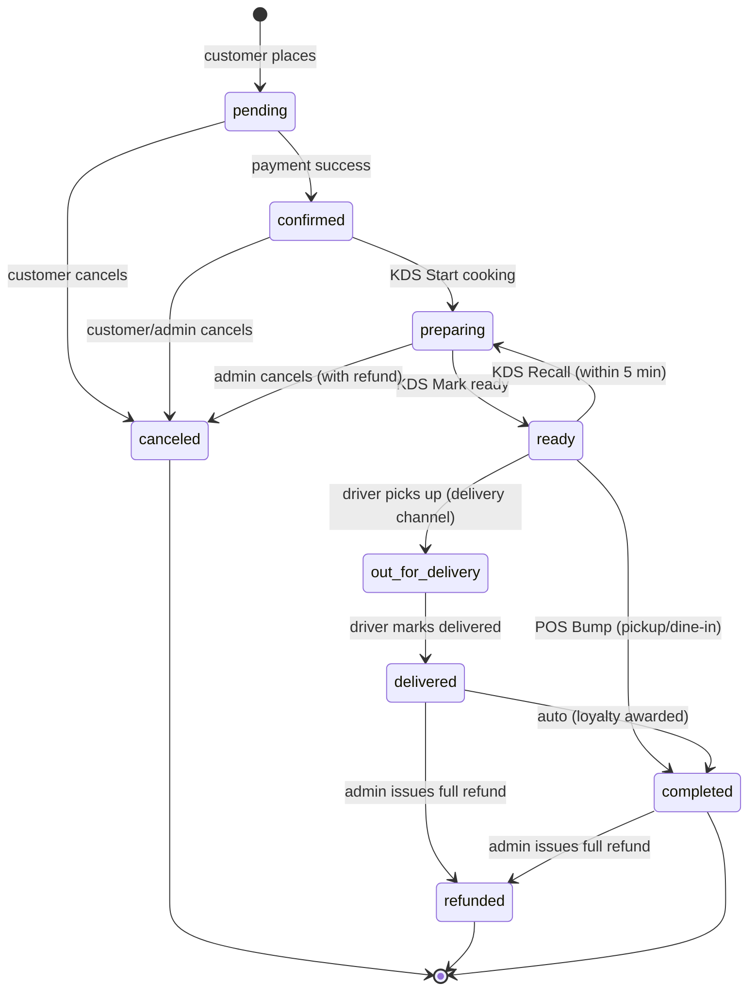
```mermaid
stateDiagram-v2
    [*] --> pending: customer places
    pending --> confirmed: payment success
    pending --> canceled: customer cancels
    confirmed --> preparing: KDS Start cooking
    confirmed --> canceled: customer/admin cancels
    preparing --> ready: KDS Mark ready
    preparing --> canceled: admin cancels (with refund)
    ready --> preparing: KDS Recall (within 5 min)
    ready --> out_for_delivery: driver picks up (delivery channel)
    ready --> completed: POS Bump (pickup/dine-in)
    out_for_delivery --> delivered: driver marks delivered
    delivered --> completed: auto (loyalty awarded)
    delivered --> refunded: admin issues full refund
    completed --> refunded: admin issues full refund
    canceled --> [*]
    refunded --> [*]
    completed --> [*]
```

### 4.2 Delivery status

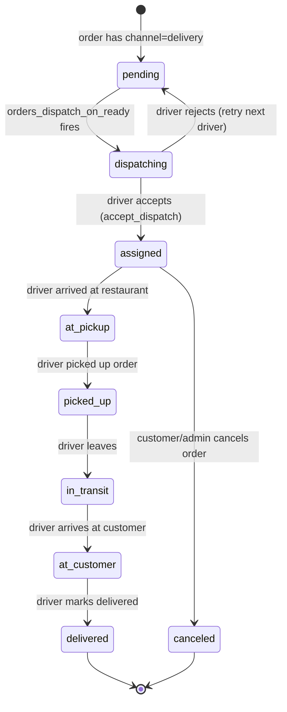
```mermaid
stateDiagram-v2
    [*] --> pending: order has channel=delivery
    pending --> dispatching: orders_dispatch_on_ready fires
    dispatching --> assigned: driver accepts (accept_dispatch)
    dispatching --> pending: driver rejects (retry next driver)
    assigned --> at_pickup: driver arrived at restaurant
    at_pickup --> picked_up: driver picked up order
    picked_up --> in_transit: driver leaves
    in_transit --> at_customer: driver arrives at customer
    at_customer --> delivered: driver marks delivered
    assigned --> canceled: customer/admin cancels order
    delivered --> [*]
    canceled --> [*]
```

### 4.3 Driver KYC status

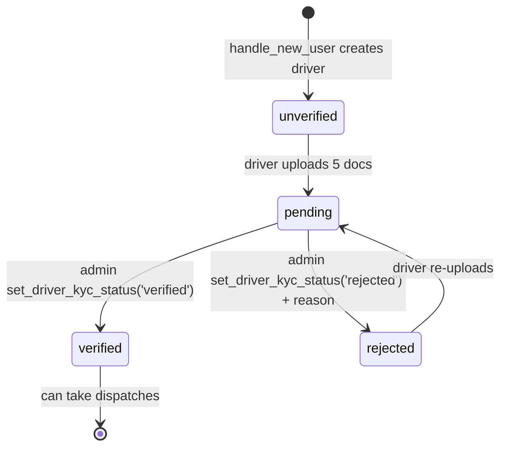
```mermaid
stateDiagram-v2
    [*] --> unverified: handle_new_user creates driver
    unverified --> pending: driver uploads 5 docs
    pending --> verified: admin set_driver_kyc_status('verified')
    pending --> rejected: admin set_driver_kyc_status('rejected') + reason
    rejected --> pending: driver re-uploads
    verified --> [*]: can take dispatches
```

### 4.4 Reservation status

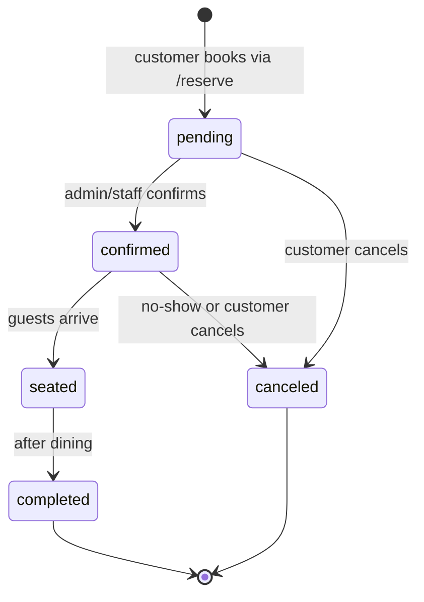
```mermaid
stateDiagram-v2
    [*] --> pending: customer books via /reserve
    pending --> confirmed: admin/staff confirms
    pending --> canceled: customer cancels
    confirmed --> seated: guests arrive
    confirmed --> canceled: no-show or customer cancels
    seated --> completed: after dining
    completed --> [*]
    canceled --> [*]
```

### 4.5 Tax invoice status

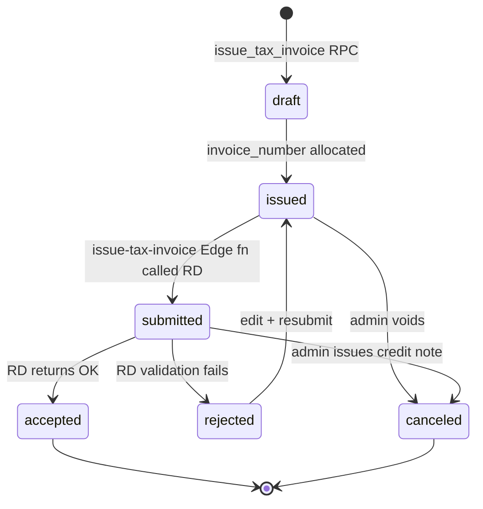
```mermaid
stateDiagram-v2
    [*] --> draft: issue_tax_invoice RPC
    draft --> issued: invoice_number allocated
    issued --> submitted: issue-tax-invoice Edge fn called RD
    submitted --> accepted: RD returns OK
    submitted --> rejected: RD validation fails
    rejected --> issued: edit + resubmit
    issued --> canceled: admin voids
    submitted --> canceled: admin issues credit note
    accepted --> [*]
    canceled --> [*]
```

### 4.6 Broadcast status

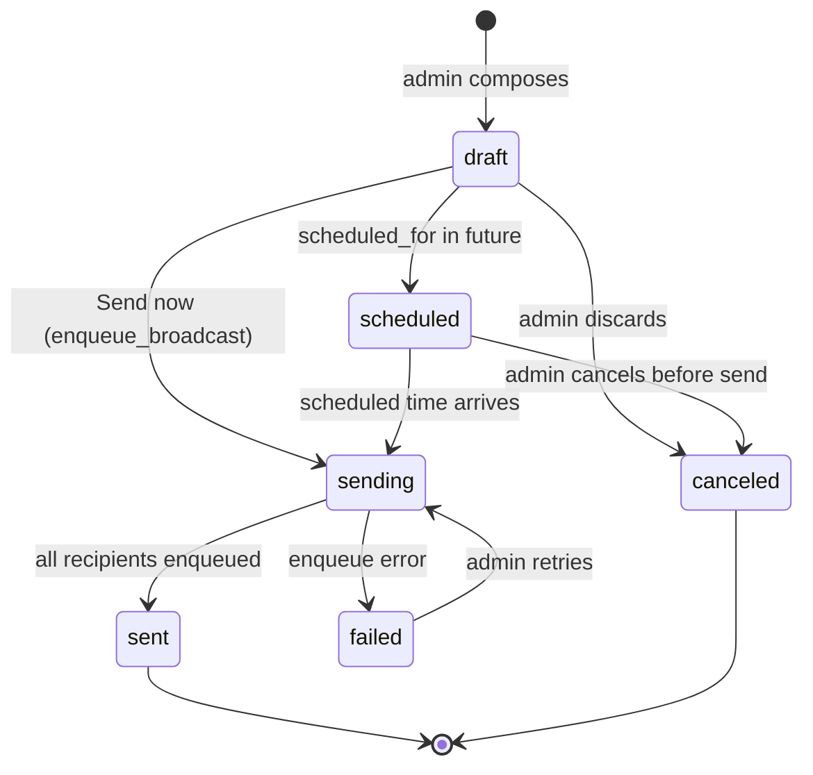
```mermaid
stateDiagram-v2
    [*] --> draft: admin composes
    draft --> scheduled: scheduled_for in future
    draft --> sending: Send now (enqueue_broadcast)
    scheduled --> sending: scheduled time arrives
    sending --> sent: all recipients enqueued
    sending --> failed: enqueue error
    failed --> sending: admin retries
    draft --> canceled: admin discards
    scheduled --> canceled: admin cancels before send
    sent --> [*]
    canceled --> [*]
```

### 4.7 Driver withdrawal

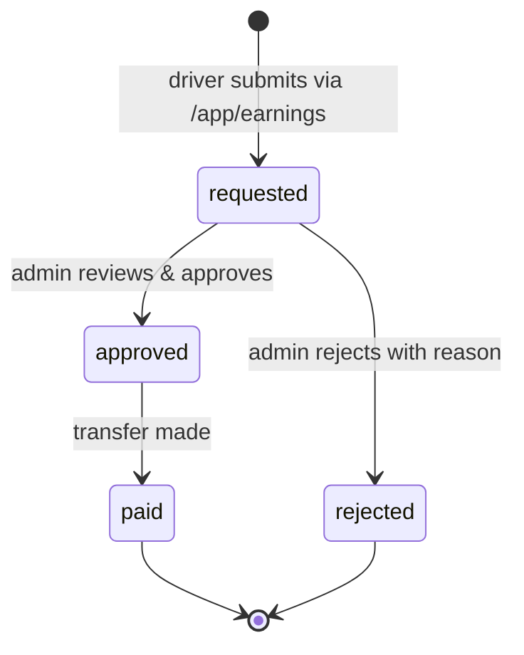
```mermaid
stateDiagram-v2
    [*] --> requested: driver submits via /app/earnings
    requested --> approved: admin reviews & approves
    requested --> rejected: admin rejects with reason
    approved --> paid: transfer made
    paid --> [*]
    rejected --> [*]
```

---

## 5. Sequence diagrams

### 5.1 Customer places order (full)

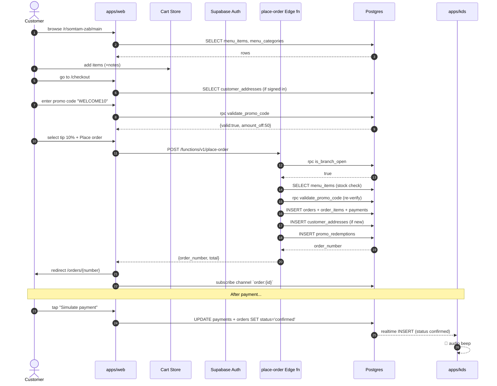
```mermaid
sequenceDiagram
    autonumber
    actor C as Customer
    participant W as apps/web
    participant Cart as Cart Store
    participant Auth as Supabase Auth
    participant Edge as place-order Edge fn
    participant DB as Postgres
    participant KDS as apps/kds

    C->>W: browse /r/somtam-zab/main
    W->>DB: SELECT menu_items, menu_categories
    DB-->>W: rows
    C->>Cart: add items (+notes)
    C->>W: go to /checkout
    W->>DB: SELECT customer_addresses (if signed in)
    C->>W: enter promo code "WELCOME10"
    W->>DB: rpc validate_promo_code
    DB-->>W: {valid:true, amount_off:50}
    C->>W: select tip 10% + Place order
    W->>Edge: POST /functions/v1/place-order
    Edge->>DB: rpc is_branch_open
    DB-->>Edge: true
    Edge->>DB: SELECT menu_items (stock check)
    Edge->>DB: rpc validate_promo_code (re-verify)
    Edge->>DB: INSERT orders + order_items + payments
    Edge->>DB: INSERT customer_addresses (if new)
    Edge->>DB: INSERT promo_redemptions
    DB-->>Edge: order_number
    Edge-->>W: {order_number, total}
    W->>C: redirect /orders/{number}
    W->>DB: subscribe channel `order:{id}`
    Note over C,KDS: After payment...
    C->>W: tap "Simulate payment"
    W->>DB: UPDATE payments + orders SET status='confirmed'
    DB-->>KDS: realtime INSERT (status confirmed)
    KDS-->>KDS: 🔔 audio beep
```

### 5.2 Driver dispatch lifecycle

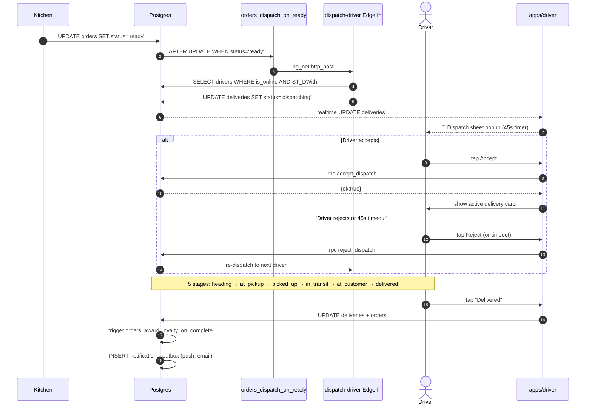
```mermaid
sequenceDiagram
    autonumber
    participant KDS as Kitchen
    participant DB as Postgres
    participant Trigger as orders_dispatch_on_ready
    participant Dispatch as dispatch-driver Edge fn
    actor D as Driver
    participant DA as apps/driver

    KDS->>DB: UPDATE orders SET status='ready'
    DB->>Trigger: AFTER UPDATE WHEN status='ready'
    Trigger->>Dispatch: pg_net.http_post
    Dispatch->>DB: SELECT drivers WHERE is_online AND ST_DWithin
    Dispatch->>DB: UPDATE deliveries SET status='dispatching'
    DB-->>DA: realtime UPDATE deliveries
    DA-->>D: 📨 Dispatch sheet popup (45s timer)
    alt Driver accepts
        D->>DA: tap Accept
        DA->>DB: rpc accept_dispatch
        DB-->>DA: {ok:true}
        DA->>D: show active delivery card
    else Driver rejects or 45s timeout
        D->>DA: tap Reject (or timeout)
        DA->>DB: rpc reject_dispatch
        DB->>Dispatch: re-dispatch to next driver
    end
    Note over D,DB: 5 stages: heading → at_pickup → picked_up → in_transit → at_customer → delivered
    D->>DA: tap "Delivered"
    DA->>DB: UPDATE deliveries + orders
    DB->>DB: trigger orders_award_loyalty_on_complete
    DB->>DB: INSERT notifications_outbox (push, email)
```

### 5.3 Cancel + refund flow

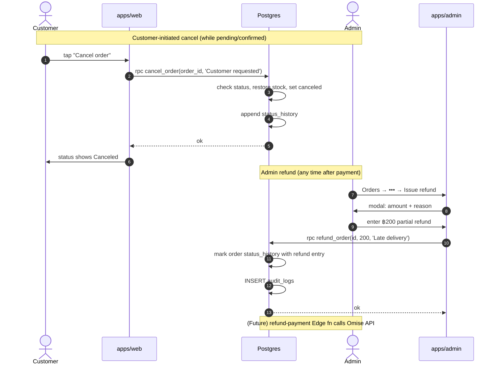
```mermaid
sequenceDiagram
    autonumber
    actor C as Customer
    participant W as apps/web
    participant DB as Postgres
    actor A as Admin
    participant Adm as apps/admin

    Note over C,A: Customer-initiated cancel (while pending/confirmed)
    C->>W: tap "Cancel order"
    W->>DB: rpc cancel_order(order_id, 'Customer requested')
    DB->>DB: check status, restore stock, set canceled
    DB->>DB: append status_history
    DB-->>W: ok
    W->>C: status shows Canceled

    Note over A,DB: Admin refund (any time after payment)
    A->>Adm: Orders → ••• → Issue refund
    Adm->>A: modal: amount + reason
    A->>Adm: enter ฿200 partial refund
    Adm->>DB: rpc refund_order(id, 200, 'Late delivery')
    DB->>DB: mark order status_history with refund entry
    DB->>DB: INSERT audit_logs
    DB-->>Adm: ok
    Note over A,DB: (Future) refund-payment Edge fn calls Omise API
```

### 5.4 Promo code validation

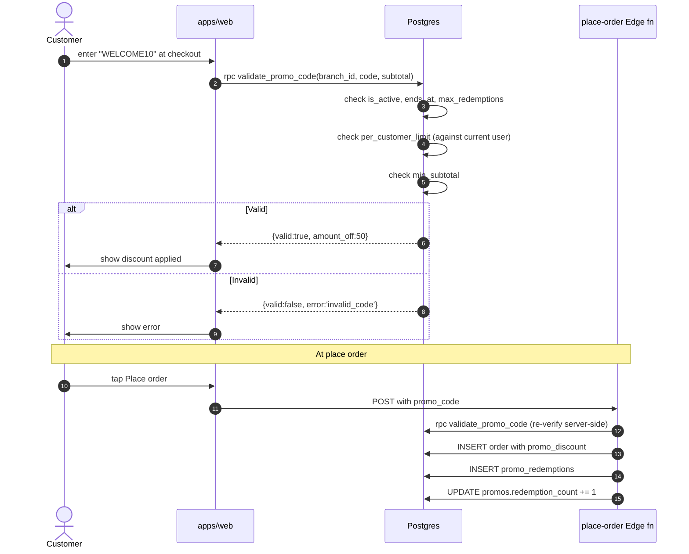
```mermaid
sequenceDiagram
    autonumber
    actor C as Customer
    participant W as apps/web
    participant DB as Postgres
    participant Edge as place-order Edge fn

    C->>W: enter "WELCOME10" at checkout
    W->>DB: rpc validate_promo_code(branch_id, code, subtotal)
    DB->>DB: check is_active, ends_at, max_redemptions
    DB->>DB: check per_customer_limit (against current user)
    DB->>DB: check min_subtotal
    alt Valid
        DB-->>W: {valid:true, amount_off:50}
        W->>C: show discount applied
    else Invalid
        DB-->>W: {valid:false, error:'invalid_code'}
        W->>C: show error
    end

    Note over C,Edge: At place order
    C->>W: tap Place order
    W->>Edge: POST with promo_code
    Edge->>DB: rpc validate_promo_code (re-verify server-side)
    Edge->>DB: INSERT order with promo_discount
    Edge->>DB: INSERT promo_redemptions
    Edge->>DB: UPDATE promos.redemption_count += 1
```

### 5.5 Loyalty award (scope-aware)

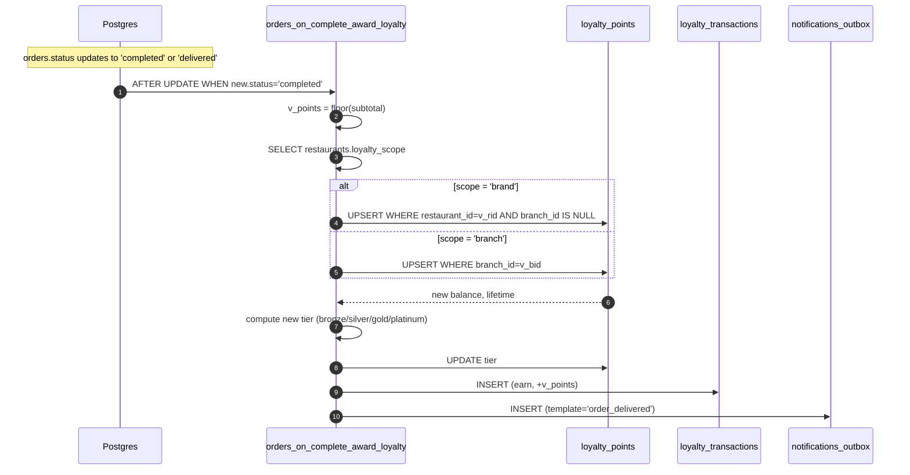
```mermaid
sequenceDiagram
    autonumber
    participant DB as Postgres
    participant T as orders_on_complete_award_loyalty
    participant LP as loyalty_points
    participant LT as loyalty_transactions
    participant Out as notifications_outbox

    Note over DB: orders.status updates to 'completed' or 'delivered'
    DB->>T: AFTER UPDATE WHEN new.status='completed'
    T->>T: v_points = floor(subtotal)
    T->>T: SELECT restaurants.loyalty_scope
    alt scope = 'brand'
        T->>LP: UPSERT WHERE restaurant_id=v_rid AND branch_id IS NULL
    else scope = 'branch'
        T->>LP: UPSERT WHERE branch_id=v_bid
    end
    LP-->>T: new balance, lifetime
    T->>T: compute new tier (bronze/silver/gold/platinum)
    T->>LP: UPDATE tier
    T->>LT: INSERT (earn, +v_points)
    T->>Out: INSERT (template='order_delivered')
```

### 5.6 Web Push delivery

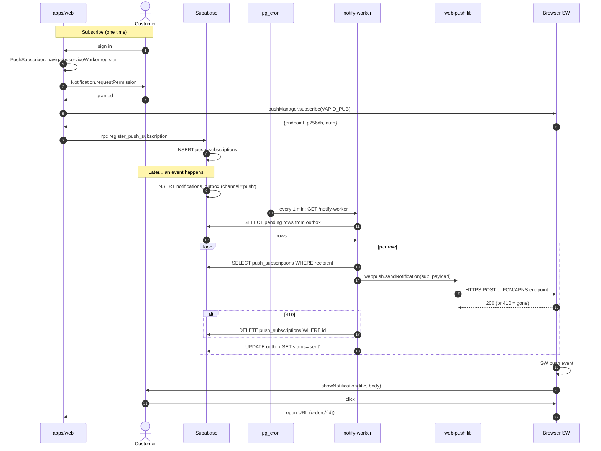
```mermaid
sequenceDiagram
    autonumber
    participant W as apps/web
    actor C as Customer
    participant SB as Supabase
    participant Cron as pg_cron
    participant NW as notify-worker
    participant WP as web-push lib
    participant Browser as Browser SW

    Note over C,W: Subscribe (one time)
    C->>W: sign in
    W->>W: PushSubscriber: navigator.serviceWorker.register
    W->>C: Notification.requestPermission
    C-->>W: granted
    W->>Browser: pushManager.subscribe(VAPID_PUB)
    Browser-->>W: {endpoint, p256dh, auth}
    W->>SB: rpc register_push_subscription
    SB->>SB: INSERT push_subscriptions

    Note over C,SB: Later... an event happens
    SB->>SB: INSERT notifications_outbox (channel='push')

    Cron->>NW: every 1 min: GET /notify-worker
    NW->>SB: SELECT pending rows from outbox
    SB-->>NW: rows
    loop per row
        NW->>SB: SELECT push_subscriptions WHERE recipient
        NW->>WP: webpush.sendNotification(sub, payload)
        WP->>Browser: HTTPS POST to FCM/APNS endpoint
        Browser-->>WP: 200 (or 410 = gone)
        alt 410
            NW->>SB: DELETE push_subscriptions WHERE id
        end
        NW->>SB: UPDATE outbox SET status='sent'
    end
    Browser->>Browser: SW push event
    Browser->>C: showNotification(title, body)
    C->>Browser: click
    Browser->>W: open URL (orders/{id})
```

### 5.7 AI menu import

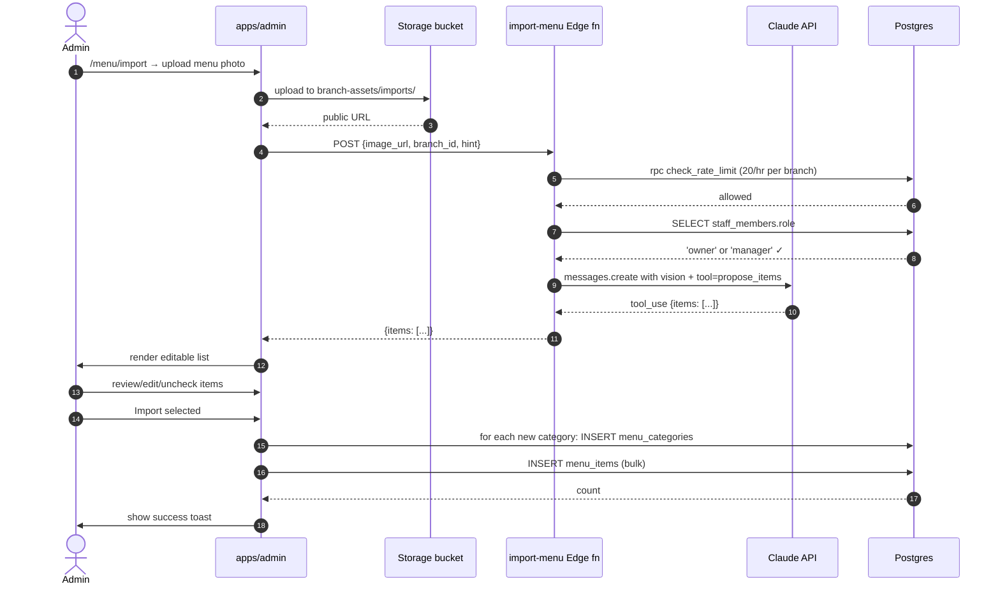
```mermaid
sequenceDiagram
    autonumber
    actor A as Admin
    participant Adm as apps/admin
    participant Bkt as Storage bucket
    participant Edge as import-menu Edge fn
    participant CL as Claude API
    participant DB as Postgres

    A->>Adm: /menu/import → upload menu photo
    Adm->>Bkt: upload to branch-assets/imports/
    Bkt-->>Adm: public URL
    Adm->>Edge: POST {image_url, branch_id, hint}
    Edge->>DB: rpc check_rate_limit (20/hr per branch)
    DB-->>Edge: allowed
    Edge->>DB: SELECT staff_members.role
    DB-->>Edge: 'owner' or 'manager' ✓
    Edge->>CL: messages.create with vision + tool=propose_items
    CL-->>Edge: tool_use {items: [...]}
    Edge-->>Adm: {items: [...]}
    Adm->>A: render editable list
    A->>Adm: review/edit/uncheck items
    A->>Adm: Import selected
    Adm->>DB: for each new category: INSERT menu_categories
    Adm->>DB: INSERT menu_items (bulk)
    DB-->>Adm: count
    Adm->>A: show success toast
```

### 5.8 Voice ordering

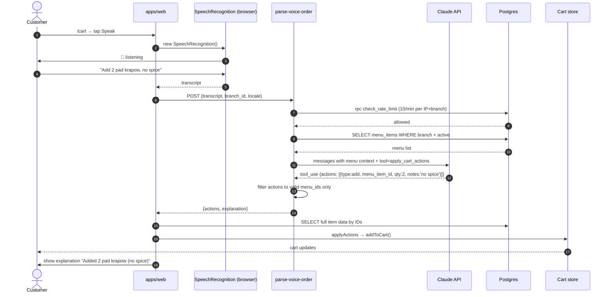
```mermaid
sequenceDiagram
    autonumber
    actor C as Customer
    participant Web as apps/web
    participant SR as SpeechRecognition (browser)
    participant Edge as parse-voice-order
    participant CL as Claude API
    participant DB as Postgres
    participant Cart as Cart store

    C->>Web: /cart → tap Speak
    Web->>SR: new SpeechRecognition()
    SR->>C: 🎤 listening
    C->>SR: "Add 2 pad krapow, no spice"
    SR-->>Web: transcript
    Web->>Edge: POST {transcript, branch_id, locale}
    Edge->>DB: rpc check_rate_limit (10/min per IP+branch)
    DB-->>Edge: allowed
    Edge->>DB: SELECT menu_items WHERE branch + active
    DB-->>Edge: menu list
    Edge->>CL: messages with menu context + tool=apply_cart_actions
    CL-->>Edge: tool_use {actions: [{type:add, menu_item_id, qty:2, notes:'no spice'}]}
    Edge->>Edge: filter actions to valid menu_ids only
    Edge-->>Web: {actions, explanation}
    Web->>DB: SELECT full item data by IDs
    Web->>Cart: applyActions → addToCart()
    Cart-->>C: cart updates
    Web->>C: show explanation "Added 2 pad krapow (no spice)"
```

### 5.9 Onboarding wizard

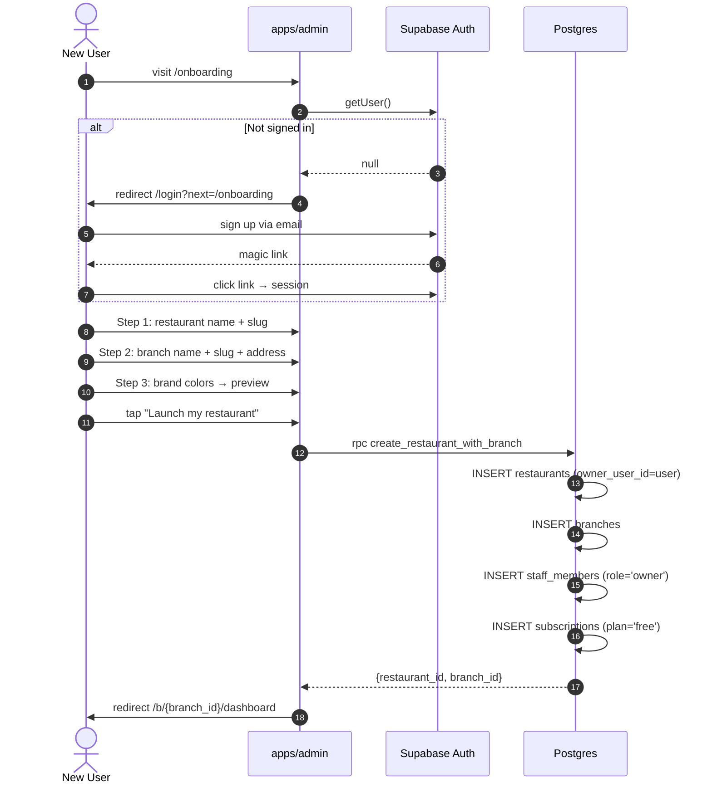
```mermaid
sequenceDiagram
    autonumber
    actor U as New User
    participant Adm as apps/admin
    participant Auth as Supabase Auth
    participant DB as Postgres

    U->>Adm: visit /onboarding
    Adm->>Auth: getUser()
    alt Not signed in
        Auth-->>Adm: null
        Adm->>U: redirect /login?next=/onboarding
        U->>Auth: sign up via email
        Auth-->>U: magic link
        U->>Auth: click link → session
    end
    U->>Adm: Step 1: restaurant name + slug
    U->>Adm: Step 2: branch name + slug + address
    U->>Adm: Step 3: brand colors → preview
    U->>Adm: tap "Launch my restaurant"
    Adm->>DB: rpc create_restaurant_with_branch
    DB->>DB: INSERT restaurants (owner_user_id=user)
    DB->>DB: INSERT branches
    DB->>DB: INSERT staff_members (role='owner')
    DB->>DB: INSERT subscriptions (plan='free')
    DB-->>Adm: {restaurant_id, branch_id}
    Adm->>U: redirect /b/{branch_id}/dashboard
```

### 5.10 Marketing broadcast fan-out

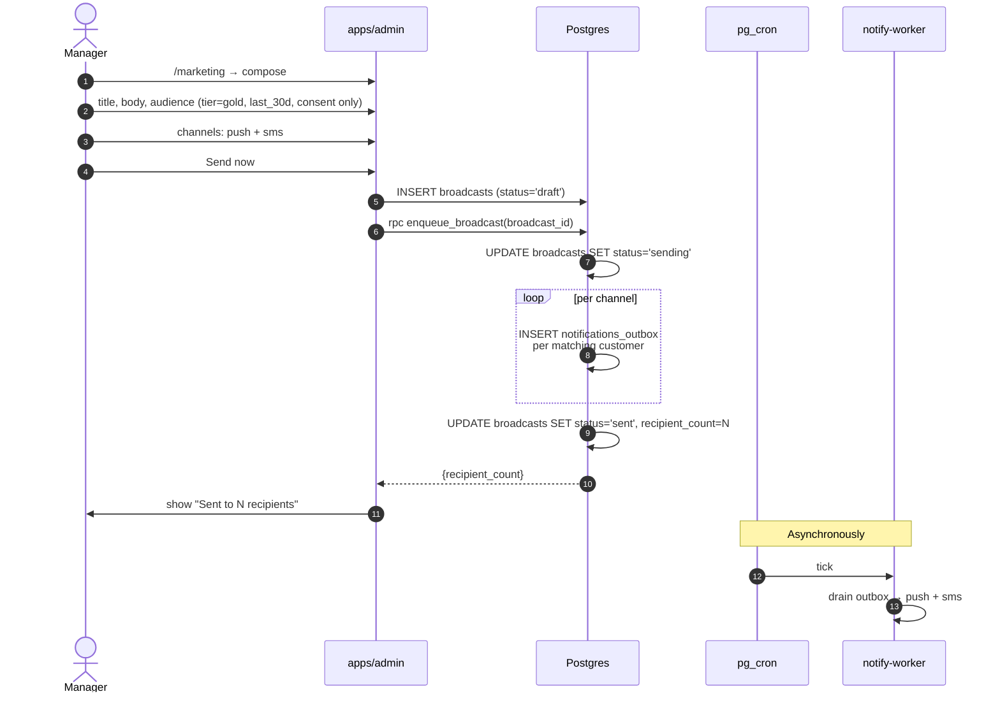
```mermaid
sequenceDiagram
    autonumber
    actor M as Manager
    participant Adm as apps/admin
    participant DB as Postgres
    participant Cron as pg_cron
    participant NW as notify-worker

    M->>Adm: /marketing → compose
    M->>Adm: title, body, audience (tier=gold, last_30d, consent only)
    M->>Adm: channels: push + sms
    M->>Adm: Send now
    Adm->>DB: INSERT broadcasts (status='draft')
    Adm->>DB: rpc enqueue_broadcast(broadcast_id)
    DB->>DB: UPDATE broadcasts SET status='sending'
    loop per channel
        DB->>DB: INSERT notifications_outbox<br/>per matching customer
    end
    DB->>DB: UPDATE broadcasts SET status='sent', recipient_count=N
    DB-->>Adm: {recipient_count}
    Adm->>M: show "Sent to N recipients"

    Note over Cron,NW: Asynchronously
    Cron->>NW: tick
    NW->>NW: drain outbox → push + sms
```

### 5.11 Franchise menu broadcast

```mermaid
sequenceDiagram
    autonumber
    actor O as Franchise Owner
    participant Adm as apps/admin
    participant DB as Postgres

    O->>Adm: /franchise → select target branches
    O->>Adm: tap "Broadcast menu"
    Adm->>DB: rpc broadcast_franchise_menu(source, target_ids[])
    loop per target branch
        DB->>DB: INSERT missing menu_categories (by name)
        DB->>DB: INSERT missing menu_items (by name)
        DB->>DB: UPDATE locked items (per franchise_menu_locks)
    end
    DB-->>Adm: {inserted_categories, inserted_items, updated_items}
    Adm->>O: show result
```

### 5.12 Platform admin impersonation

```mermaid
sequenceDiagram
    autonumber
    actor P as Platform Admin
    participant Adm as apps/admin
    participant DB as Postgres

    P->>Adm: /platform
    Adm->>DB: rpc platform_ops_summary
    DB->>DB: check private.user_is_platform_admin()
    alt Is admin
        DB-->>Adm: stats
        Adm->>P: dashboard
        P->>Adm: search restaurant → click "Open <branch>"
        Adm->>Adm: router.push(/b/{id}/dashboard)
        Note over P,DB: Same session, RLS grants platform admin cross-tenant
        P->>Adm: acts as owner of that branch
    else Not admin
        DB-->>Adm: not_platform_admin error
        Adm->>P: "Access denied" page
    end
```

---

## 6. ER diagram (core tables)

```mermaid
erDiagram
    restaurants ||--o{ branches : has
    restaurants ||--o{ brands : has
    restaurants ||--o{ subscriptions : has
    restaurants }o--|| franchise_groups : "belongs to (optional)"

    branches ||--o{ menu_categories : has
    branches ||--o{ menu_items : has
    branches ||--o{ orders : has
    branches ||--o{ customers : has
    branches ||--o{ staff_members : has
    branches }o--|| brands : "themed by (optional)"
    branches ||--o{ branch_closures : has
    branches ||--o{ tables : has

    menu_categories ||--o{ menu_items : contains

    customers ||--o{ customer_addresses : has
    customers ||--o{ orders : places
    customers ||--o{ loyalty_points : has
    customers ||--o{ loyalty_transactions : has
    customers ||--o{ order_ratings : writes
    customers ||--o{ push_subscriptions : owns
    customers ||--o{ promo_redemptions : uses

    orders ||--o{ order_items : contains
    orders ||--o| payments : has
    orders ||--o| deliveries : has
    orders ||--o{ tax_invoices : has
    orders ||--o| order_ratings : "rated by"
    orders }o--|| menu_items : items

    drivers ||--o{ driver_approvals : reviewed
    drivers ||--o{ driver_schedules : works
    drivers ||--o{ driver_withdrawals : requests
    drivers ||--o{ deliveries : delivers

    promos ||--o{ promo_redemptions : redeemed
    broadcasts }o--|| branches : "scoped to"
    notifications_outbox }o--|| branches : "scoped to"

    franchise_groups ||--o{ franchise_menu_locks : has
```

---

## 7. Auth flow (Customer Phone OTP)

```mermaid
flowchart TD
    A["Customer visits /sign-in?next=/account"] --> B["enter phone 08x-xxx-xxxx"]
    B --> C["Supabase Auth: signInWithOtp"]
    C --> D{SMS provider configured?}
    D -->|Yes Twilio| E["📱 SMS sent to phone"]
    D -->|No| F["⚠️ OTP only in Auth Logs<br/>(dev workaround)"]
    E --> G["Customer enters 6-digit code"]
    F --> G
    G --> H["verifyOtp"]
    H --> I{Valid?}
    I -->|No| G
    I -->|Yes| J["session created"]
    J --> K["trigger handle_new_user"]
    K --> L{User exists?}
    L -->|No| M["INSERT customers row"]
    L -->|Yes| N["use existing"]
    M --> O["JWT issued<br/>w/ Custom Access Token Hook:<br/>+ branch_ids[]<br/>+ restaurant_ids[]"]
    N --> O
    O --> P["redirect to ?next URL"]
    P --> Q["PushSubscriber requests<br/>Notification permission"]
    Q --> R{Granted?}
    R -->|Yes| S["register push_subscriptions"]
    R -->|No| T["skip (can subscribe later)"]
```

---

## 8. Auth flow (Staff Magic Link)

```mermaid
flowchart TD
    A["Owner/Manager visits /login"] --> B["enter email"]
    B --> C["Supabase Auth: signInWithOtp<br/>(magic link)"]
    C --> D["📧 Email sent w/ magic link"]
    D --> E["Click link in email"]
    E --> F["session created"]
    F --> G["check staff_members<br/>WHERE user_id"]
    G --> H{Has row?}
    H -->|No| I["redirect /onboarding<br/>(create restaurant)"]
    H -->|Yes| J["check role"]
    J --> K{Role}
    K -->|owner/manager| L["redirect /b/{branchId}/dashboard"]
    K -->|cashier| M["redirect POS (port 3003)"]
    K -->|kitchen| N["redirect KDS (port 3002)"]
```

---

## 9. Notifications outbox pipeline

```mermaid
flowchart LR
    subgraph Producers["Producers (INSERT outbox)"]
        P1["order events<br/>(confirmed, ready, delivered)"]
        P2["dispatch events<br/>(new dispatch)"]
        P3["stock events<br/>(low_stock)"]
        P4["marketing broadcasts<br/>(enqueue_broadcast)"]
    end

    subgraph Outbox["notifications_outbox table"]
        OQ[("queue<br/>status=pending"]
    end

    subgraph Cron["pg_cron"]
        Tick["tick every 1 min<br/>HTTP GET notify-worker"]
    end

    subgraph Worker["notify-worker Edge fn v3"]
        Drain["claim batch of 25<br/>where status pending/failed<br/>and attempts < 5"]
        Switch{channel}
        SMS["sendSms via Twilio"]
        Push["sendPush via web-push"]
        Email["sendEmail via Resend"]
        InApp["in_app: noop<br/>(driver queries outbox)"]
        Mark["UPDATE status=sent or failed"]
    end

    P1 --> OQ
    P2 --> OQ
    P3 --> OQ
    P4 --> OQ
    Tick --> Drain
    Drain --> Switch
    Switch -->|sms| SMS
    Switch -->|push| Push
    Switch -->|email| Email
    Switch -->|in_app| InApp
    SMS --> Mark
    Push --> Mark
    Email --> Mark
    InApp --> Mark
```

---

## 10. Realtime channels (subscriber map)

```mermaid
flowchart LR
    subgraph DB["Postgres + Realtime publication"]
        Orders[("orders")]
        OrderItems[("order_items")]
        Deliveries[("deliveries")]
        Outbox[("notifications_outbox")]
        MenuItems[("menu_items")]
        Reservations[("reservations")]
        Broadcasts[("broadcasts")]
    end

    subgraph Web["apps/web — Customer"]
        OrderTrack["OrderTracking<br/>channel: order:{id}"]
    end

    subgraph Driver["apps/driver"]
        DelivProv["DeliveryProvider<br/>channel: dispatch:driver:{id}"]
    end

    subgraph KDS["apps/kds"]
        KdsView["KdsView<br/>channel: kds-branch:{branchId}"]
    end

    subgraph Admin["apps/admin"]
        OrdersLive["OrdersView<br/>channel: orders-branch:{branchId}"]
        ResLive["ReservationsView<br/>channel: reservations:{branchId}"]
        Broadcast["BroadcastsPanel<br/>channel: broadcasts:{branchId}"]
    end

    Orders --> OrderTrack
    Orders --> KdsView
    Orders --> OrdersLive
    OrderItems --> KdsView
    Deliveries --> DelivProv
    Deliveries --> OrderTrack
    MenuItems --> KdsView
    Reservations --> ResLive
    Broadcasts --> Broadcast
```

---

## 11. Build + deploy pipeline

```mermaid
flowchart LR
    Dev["Developer<br/>local"] -->|push| GH[("GitHub")]
    GH -->|PR| CI{".github/workflows/ci.yml"}
    CI --> TC["pnpm -r type-check"]
    CI --> TST["pnpm -r test (Vitest)"]
    CI --> BLD["pnpm -r build (5 apps)"]
    CI --> MS["migration safety check"]

    TC -->|pass| Merge["Merge PR to main"]
    TST -->|pass| Merge
    BLD -->|pass| Merge
    MS -->|pass| Merge

    Merge --> Trigger{Changed paths?}
    Trigger -->|apps/*| Vercel["Vercel deploy<br/>(or your host)"]
    Trigger -->|supabase/functions/*| DeployFn[".github/workflows/<br/>deploy-functions.yml"]
    DeployFn --> SBCLI["supabase functions deploy"]
    SBCLI --> EFN["Edge Fns ACTIVE<br/>(new version)"]

    Vercel -->|prod URL| Prod["🌐 Production"]
    EFN --> Prod

    Sentry["Sentry"] -.->|errors| Dev
    Prod -.->|client errors| Sentry
```
